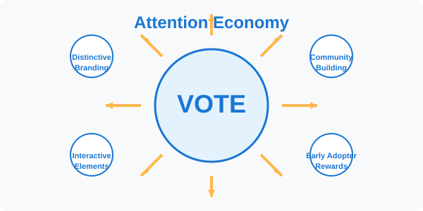
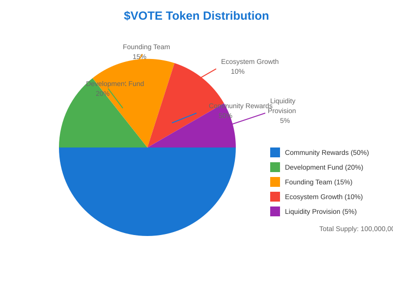
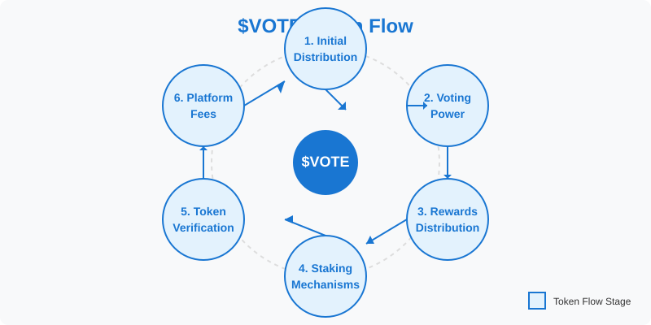
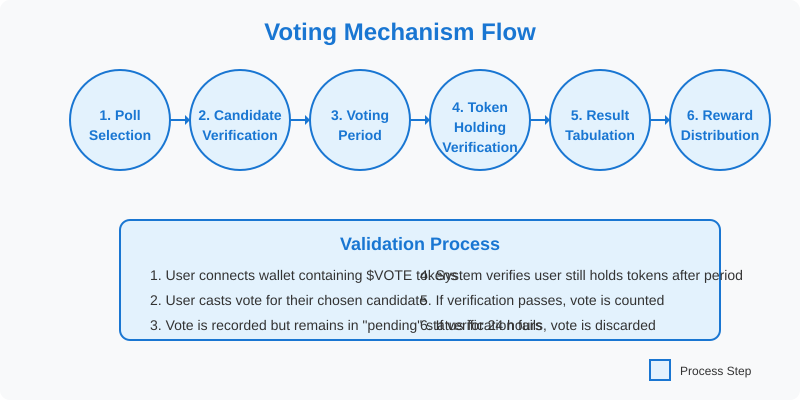

# Popular Vote Token Whitepaper
Version 1.3 | Conceptual Demonstration

## Table of Contents
1. [Executive Summary](#executive-summary)
2. [Introduction](#introduction)
   - [Market Analysis](#market-analysis)
   - [Vision and Mission](#vision-and-mission)
3. [Meme Economics](#meme-economics)
   - [Attention Economy](#attention-economy)
   - [Cultural Alignment](#cultural-alignment)
   - [Memetic Value Proposition](#memetic-value-proposition)
4. [Token Economics](#token-economics)
   - [Token Distribution](#token-distribution)
   - [Token Utility](#token-utility)
   - [Economic Sustainability](#economic-sustainability)
5. [Platform Functionality](#platform-functionality)
   - [Voting Mechanism](#voting-mechanism)
   - [User Experience](#user-experience)
6. [Security Architecture](#security-architecture)
7. [Governance Framework](#governance-framework)
8. [Community Growth Strategy](#community-growth-strategy)
9. [Conclusion](#conclusion)

## Executive Summary

The Popular Vote Token is a conceptual demonstration of a decentralized voting system built on blockchain technology that enables transparent, secure, and tamper-proof polling. Through the use of the $VOTE token, the platform creates economic incentives for participation while ensuring the integrity of the voting process. While small in scope, this project illustrates how blockchain technology could revolutionize democratic decision-making and collective opinion gathering.

## Introduction

### Market Analysis

Traditional polling and voting systems suffer from critical flaws that undermine public trust:
- **Opacity**: Vote counting occurs in centralized, closed systems
- **Security vulnerabilities**: Centralized databases are susceptible to hacking or manipulation
- **Low participation**: High friction in existing voting mechanisms
- **Limited verifiability**: Voters cannot independently verify results
- **Trust requirements**: Voters must trust authorities without cryptographic proof

### Vision and Mission

**Vision**: To create a globally trusted platform for capturing public opinion through blockchain-secured, transparent, and verifiable polling.

**Mission**: To demonstrate how blockchain technology can create a user-friendly, economically incentivized platform that revolutionizes how collective decisions are made.

## Meme Economics

The Popular Vote Token incorporates elements of meme economics to drive adoption, engagement, and long-term community formation. Memes are not just humorous internet content - they are powerful carriers of ideas, cultural signals, and value.

### Attention Economy

In today's digital economy, attention is the scarcest resource. Our platform design recognizes this by:

- Creating visually distinctive branding that resonates with crypto-native users
- Designing interactive elements that encourage sharing and virality
- Rewarding early adopters with exclusive benefits and recognition

### Cultural Alignment

The $VOTE token serves as both a functional utility and a cultural artifact that represents membership in a community with shared values. This dual nature:

- Creates stronger retention than purely speculative tokens
- Attracts participants who align with the platform's mission
- Establishes a foundation for long-term growth based on shared identity
- Drives adoption through narrative-based engagement around democratic participation

### Memetic Value Proposition

Unlike traditional utility tokens, $VOTE contains an inherent memetic component:

- **Social Signaling**: Holding $VOTE signals participation in democratic processes
- **In-Group Formation**: Creating a sense of belonging through shared participation
- **Viral Mechanisms**: Built-in incentives for users to spread the platform through social networks
- **Humor & Entertainment**: Bringing playfulness to governance through meme-inspired voting categories

The platform's "Favorite and Least Favorite Person" polls leverage universal human behaviors - celebrating heroes and criticizing villains - and transforms them into engagement mechanisms that drive community activity.

## Token Economics

### Token Distribution

The initial distribution of $VOTE tokens follows this allocation:

| Allocation | Percentage | Purpose |
|------------|------------|---------|
| Community Rewards | 50% | Rewards for active voters and poll participants |
| Development | 20% | Platform maintenance and feature development |
| Founding Team | 15% | Compensation for initial creators |
| Ecosystem Growth | 10% | Partnerships and integrations |
| Liquidity Provision | 5% | Market making and trading depth |

### Token Flow

The $VOTE token follows a circular flow within the ecosystem, incentivizing continuous participation and engagement:

1. **Initial Distribution**: Tokens enter circulation through community rewards, liquidity pools, and development allocations
2. **Voting Power**: Users hold tokens to participate in polls and governance
3. **Rewards**: Active participants earn additional tokens for voting and engagement
4. **Staking**: Users stake tokens to receive platform fee sharing
5. **Verification**: Votes are only counted if tokens remain held during the 24-hour voting period

### Token Utility

The $VOTE token serves multiple functions:

1. **Governance Participation**:
   - Vote on platform upgrades (1 token = 1 vote)
   - Signal support for proposals

2. **Platform Access**:
   - Cast votes in polls

3. **Economic Incentives**:
   - Fee sharing for stakers
   - Rewards for poll participation
   - Delegation mechanism
   - Incentives to hold tokens for participating in the next voting cycle

### Economic Sustainability

Long-term economic health is maintained through:

- **Staking Rewards**: Users who stake tokens receive a portion of platform fees
- **24-Hour Vote Verification**: Votes are only counted if the user still holds their tokens at the end of the 24-hour reset period, encouraging longer-term holding

## Platform Functionality

### Voting Mechanism

The core voting process works as follows:

1. **Poll Selection**: Users participate in curated polls with multiple candidates
2. **Verification**: Verification of candidates through trusted sources
3. **Voting Period**: Users cast votes using their tokens
4. **Token Holding Verification**: System verifies users still hold their tokens at the end of the 24-hour period
5. **Result Tabulation**: Votes are counted transparently on-chain
6. **Reward Distribution**: Participants receive token rewards

The voting mechanics employ a validation system that ensures only committed participants' votes are counted:

1. User connects wallet containing $VOTE tokens
2. User casts vote for their chosen candidate
3. Vote is recorded but remains in "pending" status
4. At the end of the 24-hour period, the system verifies the user still holds their tokens
5. If verification passes, the vote is counted; if not, the vote is discarded

This mechanism prevents "vote and dump" behavior and encourages sustained participation in the ecosystem.

Users vote on their favorite and least favorite candidates, allowing for:
- **Positive Reinforcement**: Celebrating admired figures
- **Community Standards**: Expressing disapproval of controversial figures
- **Time-Based Relevance**: Capturing changing public sentiment over time
- **Real-World Events Response**: Enabling communities to show support for or against real-world events and figures

### User Experience

The platform prioritizes user experience through:

- **Wallet Integration**: Seamless connection with popular blockchain wallets
- **Mobile Responsiveness**: Access on any device
- **Intuitive Interface**: Clear voting mechanics without technical complexity
- **Real-time Updates**: Immediate display of vote counts and poll status

## Security Architecture

As a demonstration project, the platform incorporates several security principles:

- **Transparency**: All votes are publicly verifiable
- **Immutability**: Once cast, votes cannot be altered
- **Resistance to Manipulation**: Stake-based voting prevents Sybil attacks
- **Identity Protection**: Users can vote without revealing personal details

## Governance Framework

The platform's governance follows a token-weighted voting model:

1. **Discussion Period**: Community deliberation
2. **Voting Period**: Token holders vote
3. **Execution**: Approved proposals are implemented

## Community Growth Strategy

Our strategy emphasizes organic community building through:

- **Creator Partnerships**: Collaborating with content creators for exclusive polls
- **Education**: Comprehensive documentation and tutorials
- **Targeted Outreach**: Focus on communities with aligned values
- **Real-World Relevance**: Addressing current events and topical issues to maintain engagement

## Conclusion

The Popular Vote Token demonstrates how blockchain technology can transform democratic participation. While small in scope, this project illustrates the potential for secure, transparent, and engaging polling systems.

This project is not just about voting—it's about building community around shared interests, creating economic alignment between participants, and leveraging the power of memes to spread adoption. Holding tokens creates a continuous incentive to remain engaged in future voting events, developing a committed community that actively participates in expressing support or criticism for real-world events and figures.

By combining technical innovation with cultural awareness, the Popular Vote Token points toward a future where digital governance is both effective and enjoyable.

*This whitepaper is a living document and will be updated as the Popular Vote Token evolves.* 